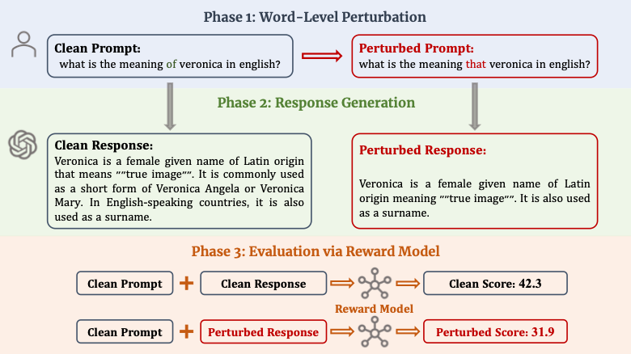

# TREvaL
We are unlocking the TREvaL to facilitate further exploration in evaluation LLMs fields.```Notably, this repo is not complete enough, we will release the full version in Oct.```

# Overview 
TREvaL(Reward Model for Reasonable Robustness evaluation), is a framework for generating word-level perturbations on open questions and evaluating the helpfulness, harmlessness robustness of LLMs via these prompts. This repo provide a codebase for TREvaL and a method to depict LLMs' loss landscapes. The repository is an implementation for:

*[TREvaL: Are Large Language Models Really Robust to Word-Level Perturbations?](https://arxiv.org/abs/2309.11166)*(Socially Responsible Language Modelling Research (SoLaR) Workshop at NeurIPS'23)

<div align="center">
  
</div>

Three perturbation forms are available:
* Misspelling
* Swapping
* Synonym

Our code builds on top of various existing repos, especially:
* Beavor Series: https://github.com/PKU-Alignment/safe-rlhf
* Llama2 Series: https://github.com/facebookresearch/llama
* Synonym: https://github.com/LinyangLee/BERT-Attack
* landscape: https://github.com/marcellodebernardi/loss-landscapes

Notably, the tested LLMs or MLMs can be obtained in each related repo above.


# Installation
To run our code, you need to have Python 3(>=3.8), conda and pip installed on your machine. The installation can be done by the following procedures:

To clone the repo:

```
git clone https://github.com/Harry-mic/TREval.git
cd TREval/
```

To create the environment and install the dependencies:

```
conda env create -f environment.yaml
conda activate TREvaL
```


# Evaluation

To do the evaluation, here is an example:

```
# LLM model: llama, alpaca, beavor, llama2, llama2-7b-chat, llama2-13b-chat, llama2-70b-chat
# MLM model: bert-base-uncased 
# Reward model: beaver-7b-v1.0-reward, beaver-7b-v1.0-cost
# task: misspelling, swapping, synonym
# attack_degree: 3, 5, 10
# dataset: nq

# The following command gather the function of generating perturbed text and interacting with the Beavor series LLMs
python Beavor_models/generate_and_attack.py --model beavor --dataset nq --task misspelling --attack_degree 10

# For interacting with Llama2 series
torchrun --nproc_per_node 1 llama2/attack.py --model llama-2-chat-7b --dataset nq --task misspelling --attack_degree 10

# For evaluating the score
python Beavor_models/eval.py --model RewardModel --dataset nq --task misspelling --attack_degree 10
```

To draw the loss landscape, here is an example:
```
python Beavor_models/create_landscape.py --model beavor --task misspelling --attack_degree 10
```
